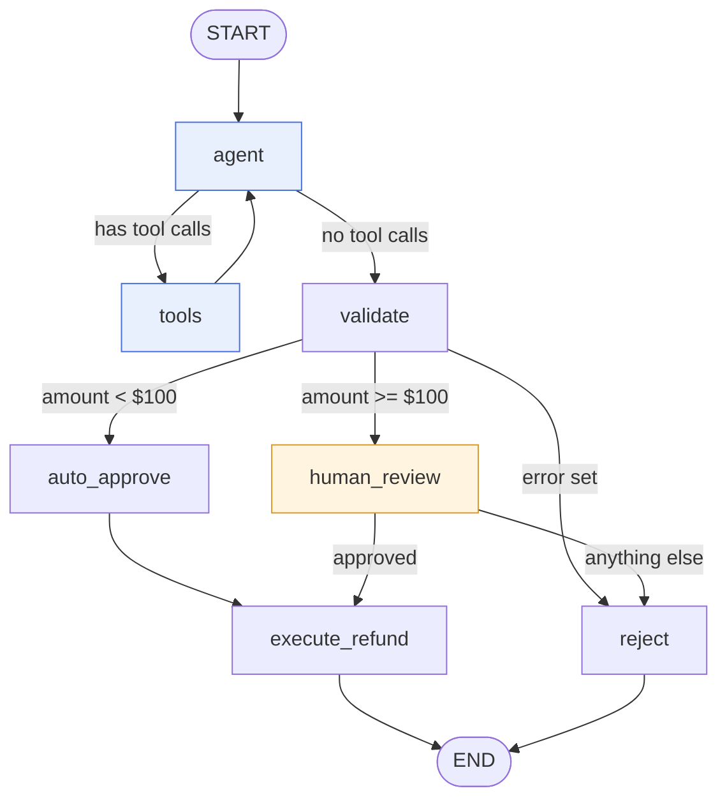

# RefundOps AI

A refund-processing workflow built with [LangGraph](https://github.com/langchain-ai/langgraph). An LLM agent gathers the facts about a refund request by calling tools. Plain Python code then validates the request and routes it. Small refunds are approved automatically, and large ones pause for a human reviewer before any money moves.

The project shows a pattern for using LLMs in a workflow that handles money: **the model gathers information, and code and people make the decisions.**

---

## Contents

- [Why it's built this way](#why-its-built-this-way)
- [The graph](#the-graph)
- [Key concepts](#key-concepts)
  - [State](#state)
  - [Nodes](#nodes)
  - [Tools and `Command`](#tools-and-command)
  - [Routing](#routing)
  - [Checkpointing and threads](#checkpointing-and-threads)
  - [Human in the loop](#human-in-the-loop)
  - [Idempotency](#idempotency)
- [A refund, step by step](#a-refund-step-by-step)
- [Project layout](#project-layout)
- [Setup](#setup)
- [Running the demo](#running-the-demo)
- [Mock data](#mock-data)
- [The standalone tool loop](#the-standalone-tool-loop-graphrun_demopy)
- [Going to production](#going-to-production)
- [Known issues](#known-issues)

---

## Why it's built this way

An LLM is good at working out what information a request needs and calling the right lookups. It is not a good place to put a rule like "refunds over $100 need a human". Its output isn't guaranteed to be the same each time, it can be persuaded by the text of a request, and it's hard to audit afterwards.

So the work is split:

| Responsibility | Handled by | Why |
|---|---|---|
| Deciding which lookups to run | LLM (`agent` node) | Flexible: works for any phrasing of the request |
| Fetching customer and order data | Tools | Returns data from a real source, not the model's memory |
| Checking the request is valid | `validate` (Python) | Deterministic, testable, auditable |
| Choosing auto-approve or review | `route_after_validate` (Python) | A fixed business rule |
| Approving large refunds | A human reviewer | Accountability for large amounts |
| Paying out | `execute_refund` (Python) | Guarded by approval checks and idempotency |

The system prompt in [nodes/nodes.py](nodes/nodes.py) says so explicitly: *"Do not approve or reject anything."* The graph's structure enforces it too: no path lets the model's output reach `execute_refund` without passing through `validate` and a routing function.

---

## The graph



The graph is built in [graph/graph.py](graph/graph.py) and has two phases:

1. **Gathering** (`agent` ⇄ `tools`): the model calls tools, sees the results and calls more until it has what it needs.
2. **Deciding** (everything after `validate`): deterministic code and, for large refunds, a person.

---

## Key concepts

### State

Every node reads from and writes to one shared dictionary, defined in [state/RefundGraphState.py](state/RefundGraphState.py):

```python
class RefundGraphState(TypedDict):
    messages: Annotated[list[AnyMessage], add_messages]
    customer_id: str
    order_id: str
    refund_amount_cents: int
    customer_history: NotRequired[CustomerRecord]
    approval_status: NotRequired[Literal["pending", "approved", "rejected", "auto_approved"]]
    refund_status: NotRequired[Literal["not_started", "executed", "failed"]]
    reviewer_id: NotRequired[str]
    error: NotRequired[str]
```

Things to know:

- **Nodes return only the fields they change.** LangGraph merges each node's returned dict into the state. A node that returns `{"approval_status": "approved"}` leaves every other field as it was.
- **`messages` uses a reducer.** `Annotated[..., add_messages]` means new messages are **appended** to the list instead of replacing it (a message with an existing ID replaces that one). This is how the conversation between the agent and the tools builds up.
- **Other fields are overwritten.** A field without a reducer takes the last value written to it.
- **`NotRequired` fields** don't exist until a node writes them. That's why the code reads them with `state.get(...)` rather than `state[...]`.
- **Undeclared fields are dropped.** If a node or tool writes a key that isn't in the schema, LangGraph ignores it. (See [Known issues](#known-issues).)
- **Money is in cents** (`refund_amount_cents: int`), which avoids floating-point rounding errors.

`NotRequired` and `TypedDict` are imported from `typing_extensions` rather than `typing` so the code runs on Python 3.9 and 3.10. `typing.NotRequired` only exists from Python 3.11.

### Nodes

A node is a plain function that takes the state and returns a partial update. They're all in [nodes/nodes.py](nodes/nodes.py).

#### `agent`
```python
response = llm.invoke([SYSTEM] + refundState["messages"])
return {"messages": [response]}
```
The system prompt is added to the front of the conversation on every call, and the model's reply is appended. If the reply contains tool calls, the graph routes to `tools`. If not, the model has finished gathering and the graph moves to `validate`.

#### `tools`
LangGraph's prebuilt `ToolNode(refund_tools)`. It runs every tool call in the model's last message and applies each tool's result to the state.

#### `validate`
The main business checks, which read what the tools collected:

| Check | Problem recorded |
|---|---|
| Customer lookup failed | `customer not found` |
| Account status isn't `ACTIVE` | `account is not active` |
| Order lookup failed | `order not found` |
| Order belongs to another customer | `customer and order do not match` |
| Order status isn't `COMPLETED` | `order is not completed` |
| Order already refunded | `order has already been refunded` |
| Amount is zero or negative | `refund amount must be positive` |
| Amount is more than the order total | `refund amount exceeds order total` |

It collects **every** problem rather than stopping at the first, so a rejection explains everything that was wrong.

#### `auto_approve`
Sets `approval_status` to `approved`. It's only reached through the routing rule for refunds under $100.

#### `human_review`
The graph pauses **before** this node runs (see [Human in the loop](#human-in-the-loop)). When it resumes, the node checks what the reviewer submitted:
- No decision (the status is still `pending`): reject, because the graph was resumed without a reviewer.
- `approved` with no `reviewer_id`: reject, because every approval must be attributable to a person.
- `rejected`: stays rejected.
- `approved` with a `reviewer_id`: passes through.

#### `execute_refund`
The only node that would move money. Before the (stubbed) payment call it checks that:
1. The refund hasn't already been executed (idempotency).
2. `approval_status` is `approved` or `auto_approved`.

#### `reject` (`auto_reject`)
Records the final rejection and adds a message with the reason, using `error` or falling back to "declined by reviewer".

### Tools and `Command`

The tools are in [custom_tools/customer_tools.py](custom_tools/customer_tools.py):

| Tool | Input | Writes to state field |
|---|---|---|
| `get_customer_info` | `customer_id` | `customer_history` |
| `fetch_orders_history` | `customer_id` | `order_history` |
| `get_order_details` | `order_id` | `order_details` |

A normal LangChain tool returns a string, which becomes a `ToolMessage` the model can read. These tools need to do two things at once:

1. **Give the model an answer**, so it can see the result and decide what to do next.
2. **Store the result in its own state field**, so that `validate` can read structured data directly instead of parsing text out of the message history.

They do both by returning a LangGraph `Command`:

```python
def _result(field, record, tool_call_id):
    return Command(update={
        field: record,
        "messages": [ToolMessage(json.dumps(record), tool_call_id=tool_call_id)],
    })
```

`tool_call_id: Annotated[str, InjectedToolCallId]` is filled in by LangGraph at runtime and **hidden from the model**. The model only sees `customer_id` or `order_id` as parameters. The ID is needed because every `ToolMessage` must refer to the tool call it answers, or the next model call fails.

When a lookup finds nothing, the tool returns `{"error": "... not found"}` instead of raising an exception. The model sees a clear answer, and `validate` treats a record containing `"error"` as a failed lookup.

The docstrings ("Call this for every refund request") matter: they are the tool descriptions the model reads when deciding what to call.

### Routing

Routing functions are in [routing/routing.py](routing/routing.py). They read the state and return the name of the next node.

```python
def route_after_validate(state):
    if state.get("error"):
        return "reject"
    if state["refund_amount_cents"] < 10_000:   # $100.00
        return "auto_approve"
    return "human_review"

def route_after_review(state):
    return "execute_refund" if state.get("approval_status") == "approved" else "reject"
```

`route_after_review` only pays out on an explicit `approved`. Any other value, including a missing one, leads to `reject`. When the input is unexpected, the safe default is not to pay.

After `agent`, the graph uses LangGraph's prebuilt `tools_condition`. It returns `"tools"` if the last message has tool calls and `END` otherwise. The graph maps `END` to `validate`, so "the model is done" means "start validating", not "stop".

### Checkpointing and threads

```python
graph = builder.compile(checkpointer=MemorySaver(), interrupt_before=["human_review"])
```

A **checkpointer** saves the full state after every step. Saves are grouped by **thread**, which is identified in the config:

```python
config = {"configurable": {"thread_id": f"refund-{order_id}"}}
```

Each refund gets its own thread, named after the order ID. This means:
- A paused refund can be picked up later exactly where it stopped.
- `graph.get_state(config)` shows a refund's current state and which node runs next.
- Refunds don't share state.

`MemorySaver` keeps checkpoints in memory, so they're lost when the process exits. That's fine for the demo. See [Going to production](#going-to-production) for persistent options.

### Human in the loop

`interrupt_before=["human_review"]` tells LangGraph to stop just before `human_review` runs and save a checkpoint. The stream ends, and `graph.get_state(config).next` is `("human_review",)`.

A reviewer then records their decision and resumes the thread, as `main.py` does:

```python
graph.update_state(config, {"approval_status": "approved", "reviewer_id": "agent_7"})
graph.stream(None, config)   # None = resume from the checkpoint, don't start over
```

- `update_state` writes the reviewer's decision into the saved state as if a node had returned it.
- Streaming with `None` as input continues the existing thread instead of starting a new run.
- `human_review` then runs, checks the decision, and `route_after_review` sends the refund to `execute_refund` or `reject`.

In a real system, the pause is where you'd put the refund in a review queue, show it in an admin UI, and resume the thread when someone clicks Approve or Reject, possibly hours later.

### Idempotency

"Idempotent" means that running an operation twice has the same effect as running it once. For payouts, that's the difference between refunding a customer once and refunding them twice.

`execute_refund` returns immediately if `refund_status` is already `executed`. A retried step or a thread resumed twice won't pay again. The commented-out payment call also passes `idempotency_key=order_id`, which most payment providers support, so the provider itself will reject a duplicate even if the workflow somehow sends one.

---

## A refund, step by step

Here is what should happen for a $150 refund on a valid order, the case that needs a reviewer:

1. **Start.** `main.py` calls `graph.stream(...)` with a `HumanMessage` ("Refund order … for customer …") and the IDs and amount in state.
2. **`agent`.** The model reads the request and replies with tool calls, often all three at once: `get_customer_info`, `fetch_orders_history` and `get_order_details`.
3. **`tools`.** Each tool looks up the mock data, writes its state field and appends a `ToolMessage`.
4. **`agent` again.** The model sees the results. With nothing left to look up, it replies without tool calls.
5. **`validate`.** Every check passes, so `approval_status` becomes `pending`.
6. **`route_after_validate`.** 15,000 cents is not under 10,000, so the next node is `human_review`.
7. **Pause.** The graph stops before `human_review`. `main.py` prints a summary showing `⏸ Paused before: human_review`.
8. **Reviewer.** `update_state` sets `approval_status="approved"` and `reviewer_id="agent_7"`.
9. **Resume.** `graph.stream(None, config)` runs `human_review`, which accepts the attributed approval.
10. **`route_after_review`.** The status is `approved`, so the next node is `execute_refund`.
11. **`execute_refund`.** It isn't a duplicate and it is approved, so `refund_status` becomes `executed`.
12. **End.** The final summary shows the approval, the refund status and the reviewer.

A $50 refund follows steps 1 to 5, then goes through `auto_approve` to `execute_refund` without pausing. A request that fails validation goes from `validate` straight to `reject`, with the reasons in `error`.

---

## Project layout

```
refundops-ai/
├── main.py                        # Demo: streams three refund scenarios and prints each step
├── graph/
│   ├── graph.py                   # Adds nodes and edges, compiles with checkpointer and interrupt
│   └── run_demo.py                # Manual tool-calling loop without LangGraph (for learning)
├── state/
│   └── RefundGraphState.py        # The shared state schema
├── nodes/
│   └── nodes.py                   # agent, validate, auto_approve, human_review, execute_refund, reject
├── routing/
│   ├── __init__.py
│   └── routing.py                 # route_after_validate, route_after_review
├── llm/
│   └── llm.py                     # Builds the ChatOpenAI model and binds the tools
├── custom_tools/
│   └── customer_tools.py          # The three lookup tools
├── model/mock/
│   ├── customer.py                # CUSTOMERS
│   └── orders.py                  # ORDERS, ORDERS_HISTORY
├── .env.example
└── .gitignore
```

---

## Setup

### Requirements

- Python 3.9 or later
- An OpenAI API key

### Install

```bash
git clone <repo-url> refundops-ai
cd refundops-ai

python3 -m venv .venv
source .venv/bin/activate

pip install langgraph langchain-openai python-dotenv typing_extensions
```

Tested with langgraph 0.6.11, langchain-core 0.3.86, langchain-openai 0.3.35 and python-dotenv 1.2.1.

### Configure

```bash
cp .env.example .env
```

Then edit `.env`:

| Variable | Required | Default | Purpose |
|---|---|---|---|
| `OPENAI_API_KEY` | Yes | | Used by `ChatOpenAI`. The app raises an error at startup if it's missing. |
| `REFUND_MODEL` | No | `gpt-4o-mini` | The chat model the agent uses |

The model settings in [llm/llm.py](llm/llm.py) are chosen for a money workflow:

| Setting | Value | Why |
|---|---|---|
| `temperature` | `0` | Makes tool calling as predictable as possible |
| `timeout` | `30` seconds | A slow API call can't hang a refund thread indefinitely |
| `max_retries` | `2` | Recovers from brief network errors and rate limits |

`.env` is in `.gitignore`, so your key won't be committed.

---

## Running the demo

```bash
python main.py
```

`main.py` runs three scenarios. Each one:

1. Streams the graph with `stream_mode="updates"`, so only the fields each node **changed** are printed, under a `▶ <node>` heading. Messages are pretty-printed, so you can see the model's tool calls and the tools' replies.
2. Prints a summary box with the order, amount, approval status, refund status, reason, reviewer and whether the graph is paused.
3. If the graph paused at `human_review` and the scenario includes a reviewer decision, submits it, resumes and prints the final summary.

| # | Call | Amount | Intended outcome |
|---|---|---|---|
| 1 | `process("C101", "O1002", 5_000)` | $50 | Under $100: auto-approved and executed |
| 2 | `process("C102", "O1004", 12_000)` | $120 | Already refunded: rejected by `validate` |
| 3 | `process("C101", "O1008", 15_000, approve=True)` | $150 | Over $100: pauses, reviewer approves, resumes and executes |

Each run makes real OpenAI API calls, usually two or three per scenario.

To try your own case, call `process(customer_id, order_id, amount_cents, approve=True|False|None)`. With `approve=None`, the run stays paused at review.

---

## Mock data

All data is in memory, in [model/mock/](model/mock/).

**Customers**

| ID | Name | Status |
|---|---|---|
| C101 | John | ACTIVE |
| C102 | Sarah | ACTIVE |

**Orders**

| ID | Customer | Status | Amount |
|---|---|---|---|
| O1001 | C101 | REFUNDED | $100.00 |
| O1002 | C101 | DELIVERED | $50.00 |
| O1003 | C102 | REFUNDED | $75.00 |
| O1004 | C102 | REFUNDED | $120.00 |
| O1005 | C102 | REFUNDED | $200.00 |
| O1006 | C102 | REFUNDED | $150.00 |
| O1007 | C102 | DELIVERED | $80.00 |

`ORDERS_HISTORY` also records a refund count per customer: 1 for C101 and 5 for C102.

The mock order amounts are **in dollars** (floats), while the graph works **in cents** (ints).

---

## The standalone tool loop (`graph/run_demo.py`)

[graph/run_demo.py](graph/run_demo.py) does the "call the model, run its tools, repeat" loop by hand, without LangGraph. It's useful for seeing what `ToolNode` and `tools_condition` do for you:

- It stops after at most 5 rounds, so a confused model can't loop forever.
- It calls `tool.invoke(call)` with the **whole** tool call, not just `call["args"]`, so the injected `tool_call_id` gets filled in.
- Because the tools return a `Command`, it takes the `ToolMessage` out of `result.update["messages"]` itself.
- Errors from a tool are sent back to the model as a `ToolMessage` instead of crashing the loop.

```bash
python -m graph.run_demo
```

---

## Going to production

What this demo would need to become a real service:

- **Persistent checkpoints.** Replace `MemorySaver` with `SqliteSaver` or `PostgresSaver` (from `langgraph-checkpoint-sqlite` / `langgraph-checkpoint-postgres`) so paused refunds survive restarts.
- **Real data sources.** Replace the mock dictionaries with database or API calls.
- **A real payment call.** Implement the stubbed `payment_api.refund(...)` in `execute_refund`, keeping `idempotency_key=order_id`.
- **A review interface.** Put paused threads in a queue, show them to reviewers, and call `update_state` and resume when a decision is made. Use the reviewer's real identity for `reviewer_id`.
- **Configurable thresholds.** Move the $100 limit out of the code into configuration, and consider rules based on the refund count in `order_history`.
- **Audit logging.** Store each thread's final state and message history.
- **Tests.** `validate` and the routing functions are pure functions and easy to unit-test without an LLM.
- **Pinned dependencies.** Add a `requirements.txt` or `pyproject.toml`.

---

## Known issues

The project is a work in progress. These issues currently change what the demo prints:

1. **Tool results are dropped.** `RefundGraphState` doesn't declare `order_details` or `order_history`, so LangGraph ignores what those tools write, and `validate` always sees an empty order. Fix: add both fields as `NotRequired[dict]`.
2. **Failed validation isn't routed to `reject`.** `validate` returns its reasons under `problems`, which isn't a state field, instead of `error`, which `route_after_validate` checks. Failed requests go on to `auto_approve` or `human_review`. Fix: return `{"approval_status": "rejected", "error": "; ".join(problems)}`.
3. **Reviewer approvals are rejected.** `human_review` has a double negative (`if not ... not in [...]`) that rejects exactly the valid decisions. Fix: remove the leading `not`.
4. **Field names don't match the mock data.** `validate` expects the status `COMPLETED` and the fields `total_amount_cents` and `already_refunded`. The mock data uses `DELIVERED`/`REFUNDED` and `amount` in dollars. Customer records also have no `customer_id`, so the customer/order match check always fails.
5. **Scenario 3 uses an order that doesn't exist.** `O1008` isn't in the mock data. Add it, or point the scenario at an existing order.
6. **Minor:**
   - `auto_approve` sets `approved` rather than the `auto_approved` value the schema defines, so auto and manual approvals can't be told apart.
   - `state/RefundGraphState.py` calls `load_dotenv()` and imports `get_customer_info` without using it.
   - `graph/graph.py` prints the state schema at import time.
